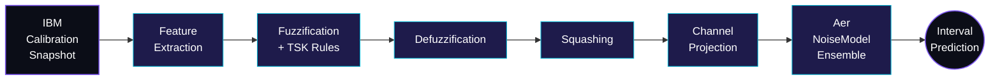

<!--
  SuperconducTED · organization profile README
  Path:   .github/profile/README.md  (inside a repo named ".github" at the org level)
  Assets: .github/profile/assets/header.svg
          .github/profile/assets/fuzzy-noise.svg
  Style:  no em/en dashes; middle dots and colons only.
-->

<p align="center">
  
</p>

<p align="center">
  
</p>

<p align="center">
  <a href="https://github.com/SuperconducTED/superconducted-noise-engine"></a>
  
  
  
</p>

<p align="center">
  
  
  
</p>

---

## ❯ Manifesto

Qiskit Aer accepts **crisp** numbers for noise. Real superconducting qubits drift between every IBM calibration. We close the gap with a Takagi·Sugeno·Kang fuzzy inference layer that turns calibration snapshots into an *ensemble* of `NoiseModel` instances, then aggregates simulations into **interval-valued** predictions that bracket real hardware across calibration cycles.

If `0.686%` fidelity deviation on a single snapshot is the bar (Bautra et al., 2026), **transferability across snapshots** is the rope we're trying to climb past it.

## ❯ The pipeline



<sub>Six stages, one Factory · Ensemble at the seam with Aer. The no-per-shot-Python-hook constraint is respected by realising epistemic uncertainty at <i>ensemble construction time</i>, not at simulation time.</sub>

Architecture detail: [`docs/architecture.md`](https://github.com/SuperconducTED/superconducted-noise-engine/blob/main/docs/architecture.md) · Decision ledger (ADRs): [`docs/decisions.md`](https://github.com/SuperconducTED/superconducted-noise-engine/blob/main/docs/decisions.md)

## ❯ How fuzzy noise actually works

<p align="center">
  
</p>

A crisp `T1 = 142 µs` is what Aer wants. A real backend that just got recalibrated wants a *range* of plausible values weighted by membership. We fuzzify the snapshot through the TSK rule base, sample N concrete `NoiseModel` instances from the resulting envelope, run each through Aer in parallel, and report `[p_lo, p_hi]` instead of a single fidelity number. The win is that the real IBM datapoint lives **inside the interval** the next time the backend gets recalibrated, which is what crisp baselines stop doing the moment the snapshot they were tuned on goes stale.

## ❯ Stack

<p align="center">
  
  
  
  
  
  
  
  
  
</p>

## ❯ Repositories

<p>
  <a href="https://github.com/SuperconducTED/superconducted-noise-engine">
    
  </a>
</p>

## ❯ Activity

<p align="center">
  
</p>

## ❯ Roadmap

<table>
  <thead>
    <tr>
      <th width="80">Phase</th>
      <th width="260">Milestone</th>
      <th>Status</th>
    </tr>
  </thead>
  <tbody>
    <tr>
      <td align="center"><b>0</b></td>
      <td>Calibration polling pipeline</td>
      <td> <code>superconducted-poll</code> · cron · idempotent</td>
    </tr>
    <tr>
      <td align="center"><b>1</b></td>
      <td>≥ 630 snapshot dataset</td>
      <td> ANFIS training prerequisite</td>
    </tr>
    <tr>
      <td align="center"><b>2</b></td>
      <td>TSK rule base · fuzzy uncertainty envelope</td>
      <td></td>
    </tr>
    <tr>
      <td align="center"><b>3</b></td>
      <td>Whitepaper · benchmark vs. Bautra 2026</td>
      <td></td>
    </tr>
  </tbody>
</table>

## ❯ Now shipping

> Phase 0 deliverable is live. `superconducted-poll` archives IBM backend calibration snapshots on a cron, building the historical record needed for fuzzy training. Phase 1 is dataset accumulation: every four hours, another data point.

## ❯ Field notes

<i>The lab log. Most recent on top. Each entry links to the issue, PR, or ADR it came from.</i>

- **Phase 0 · shipped.** Calibration polling pipeline went live with the `superconducted-poll` console script. Cron-friendly, idempotent, one invocation per round. → [flagship repo](https://github.com/SuperconducTED/superconducted-noise-engine)
- **ADR · Factory · Ensemble pattern adopted.** Aer's no-per-shot-Python-hook constraint forced the design hand: epistemic uncertainty has to be realised at *ensemble construction* time, not per shot. → [`docs/decisions.md`](https://github.com/SuperconducTED/superconducted-noise-engine/blob/main/docs/decisions.md)
- **Decision · benchmark target locked.** Bautra et al. 2026's `0.686%` fidelity deviation chosen as the single-snapshot bar. Our differentiator is *transferability*, not snapshot accuracy.
- **Polling cadence · every 4 hours.** Targets a ≥ 630 snapshot working minimum over a 90 day window. Tunable via cron.

<sub>Want to write the next entry? See the <a href="https://github.com/SuperconducTED/superconducted-noise-engine/issues">open issues</a> on the flagship.</sub>

---

## ❯ Reference

<details>
  <summary><b>Quick start</b> · clone, install, test</summary>

  ```bash
  git clone https://github.com/SuperconducTED/superconducted-noise-engine.git
  cd superconducted-noise-engine
  python -m venv .venv
  # Windows:  .venv\Scripts\activate
  # POSIX:    source .venv/bin/activate
  pip install -r requirements.txt -r requirements-dev.txt
  pip install -e . --no-deps
  pytest
  ```

  Drop your IBM Quantum token into `.env` (template at `.env.example`) and run `superconducted-poll --backend ibm_fez`.
</details>

<details>
  <summary><b>Glossary</b> · for non-quantum visitors</summary>
  <br>
  <table>
    <tbody>
      <tr><td><b>TSK</b></td><td>Takagi·Sugeno·Kang fuzzy inference. Rules of the form <i>"if x is A then y = f(x)"</i> where <i>f</i> is a crisp function. Maps calibration features to noise parameters.</td></tr>
      <tr><td><b>IT2</b></td><td>Interval Type·2 fuzzy set. The membership grade is itself an interval, not a single number. Encodes uncertainty about <i>where</i> the membership function lives.</td></tr>
      <tr><td><b>ANFIS</b></td><td>Adaptive Network-based Fuzzy Inference System. A neural-style architecture for learning TSK rule parameters from data. Needs a non-trivial dataset, hence the ≥ 630 snapshot floor.</td></tr>
      <tr><td><b>T1 / T2</b></td><td>Energy relaxation time and decoherence time of a qubit, in microseconds. The two dominant noise channels on superconducting hardware.</td></tr>
      <tr><td><b>Aer</b></td><td>Qiskit's high-performance simulator. Accepts a <code>NoiseModel</code>, but only as crisp scalar parameters.</td></tr>
      <tr><td><b>NoiseModel</b></td><td>Qiskit's bundle of Kraus operators and channels applied to specific gates and qubits. The thing we ensemble.</td></tr>
      <tr><td><b>Calibration snapshot</b></td><td>A point-in-time export of IBM backend properties (T1, T2, gate errors, readout errors) from the IBM Quantum API.</td></tr>
      <tr><td><b>Fidelity</b></td><td>A scalar in [0, 1] measuring how close a simulated output distribution is to a real one. Standard quality metric.</td></tr>
      <tr><td><b>Cooper pair</b></td><td>The bound electron pair responsible for superconductivity in the transmon qubits IBM hardware uses. Out of scope for the code, in scope for the vibes.</td></tr>
    </tbody>
  </table>
</details>

<details>
  <summary><b>FAQ</b> · the questions we keep getting</summary>
  <br>

  **Why fuzzy logic, not Bayesian inference?**
  Bayesian priors want a joint distribution over noise parameters. We don't have one. We have *expert intuition* about which parameter ranges stay plausible after a calibration drift, which is exactly what TSK rules express. Fuzzy is the right hammer for ordinal, linguistic, sparse-data uncertainty. A Bayesian cross-check is on the roadmap, not a replacement.

  **Why only IBM backends?**
  The IBM Quantum API exposes a uniform calibration schema across all transmon backends, which makes polling and feature extraction reproducible. Other vendors (IonQ, Rigetti, Quantinuum) characterise noise differently (e.g. trapped-ion gates aren't parameterised the same way). Multi-vendor support is a Phase 4 conversation, not a Phase 1 one.

  **Why Aer, not pulse-level simulation?**
  Aer is the standard. Pulse-level simulators (Qiskit Dynamics and friends) are more accurate per snapshot but slower by orders of magnitude. Our value proposition is *transferability across snapshots*, so we want the fast inner loop. The fuzzy envelope absorbs the per-snapshot accuracy gap.

  **What's the ≥ 630 number?**
  ANFIS rule consequents need enough calibration snapshots to fit without overfitting. 630 = 90 days × 7 snapshots per day at the current polling cadence. Working minimum, not a magic threshold.

  **Can I use this without an IBM Quantum account?**
  For the polling stage, no. For the noise modeling stage, yes: bring your own calibration JSON in the documented schema and the engine doesn't care where it came from.

  **Why fuzzy on the *outside* of Aer instead of inside the noise channel?**
  Aer's simulator loop is C++. There's no Python hook per shot. The Factory · Ensemble pattern was the cleanest way to keep Aer fast and still get a fuzzy result: build many crisp `NoiseModel` instances up front, simulate each, aggregate at the end.
</details>

<details>
  <summary><b>Why fuzzy, why now</b> · the long version</summary>
  <br>
  <p>Aer's noise model is a single point in parameter space. Real backends move. The literature reports excellent fidelity on the snapshot it was tuned on, then degrades silently when calibration shifts. Interval Type·2 fuzzy systems let us encode <i>epistemic</i> uncertainty (we don't know exactly where the backend is right now) on top of the <i>aleatoric</i> noise Aer already handles. Ensemble construction respects Aer's no-per-shot-Python-hook constraint. It's the kind of fit that only looks obvious once you stop trying to make a single number do two jobs.</p>
</details>

<details>
  <summary><b>The lab</b> · five contributors + faculty advisor</summary>
  <br>
  <p>The lab sits inside the Computer Engineering program at TED University, Ankara. Module ownership and the contributor roster live in <a href="https://github.com/SuperconducTED/superconducted-noise-engine/blob/main/docs/team.md"><code>docs/team.md</code></a>.</p>
</details>

<details>
  <summary><b>Contributing</b></summary>
  <br>
  <ul>
    <li>Open issues live on the <a href="https://github.com/SuperconducTED/superconducted-noise-engine/issues">flagship repo</a>.</li>
    <li>Run <code>pytest</code> before pushing. CI mirrors local.</li>
    <li>Architectural changes go through an ADR in <code>docs/decisions.md</code>.</li>
    <li>Never commit a real <code>IBM_QUANTUM_TOKEN</code>. <code>.env</code> is gitignored; <code>.env.example</code> is the template.</li>
  </ul>
</details>

---

<p align="center">
  <sub>Made in Ankara · powered by curiosity, caffeine, and Cooper pairs.</sub>
</p>

<picture>
  
</picture>
