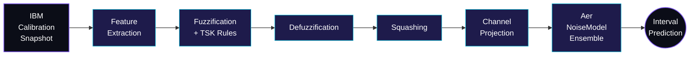

<!--
  SuperconducTED · organization profile README
  Path: .github/profile/README.md  (inside a repo named ".github" at the org level)
  Style: no em/en dashes; middle dots and colons only.
-->

<picture>
  <source media="(prefers-color-scheme: dark)" srcset="https://capsule-render.vercel.app/api?type=waving&color=0:0b0d17,50:1e1b4b,100:06b6d4&height=210&section=header&text=SuperconducTED&fontSize=72&fontColor=ffffff&fontAlignY=38&desc=The%20TED%20in%20superconducted%20%C2%B7%20TED%20University%20%C2%B7%20Ankara&descAlign=50&descAlignY=62&descSize=16&animation=fadeIn">
  
</picture>

<p align="center">
  
</p>

<p align="center">
  <a href="https://github.com/SuperconducTED/superconducted-noise-engine"></a>
  
  
  
</p>

<p align="center">
  <a href="https://github.com/SuperconducTED"></a>
  
  
</p>

---

## ❯ Manifesto

Qiskit Aer accepts **crisp** numbers for noise. Real superconducting qubits drift between every IBM calibration. We close the gap with a Takagi·Sugeno·Kang fuzzy inference layer that turns calibration snapshots into an *ensemble* of `NoiseModel` instances, then aggregates simulations into **interval-valued** predictions that bracket real hardware across calibration cycles.

If `0.686%` fidelity deviation on a single snapshot is the bar (Bautra et al., 2026), **transferability across snapshots** is the rope we're trying to climb past it.

## ❯ The pipeline



<sub>Six stages, one Factory · Ensemble at the seam with Aer. The no-per-shot-Python-hook constraint is respected by realising epistemic uncertainty at <i>ensemble construction time</i>, not at simulation time.</sub>

Architecture detail: [`docs/architecture.md`](https://github.com/SuperconducTED/superconducted-noise-engine/blob/main/docs/architecture.md) · Decision ledger (ADRs): [`docs/decisions.md`](https://github.com/SuperconducTED/superconducted-noise-engine/blob/main/docs/decisions.md)

## ❯ Stack

<p align="center">
  
  
  
  
  
  
  
  
  
</p>

## ❯ Repositories

<p>
  <a href="https://github.com/SuperconducTED/superconducted-noise-engine">
    
  </a>
</p>

## ❯ Roadmap

<table>
  <thead>
    <tr>
      <th width="80">Phase</th>
      <th width="260">Milestone</th>
      <th>Status</th>
    </tr>
  </thead>
  <tbody>
    <tr>
      <td align="center"><b>0</b></td>
      <td>Calibration polling pipeline</td>
      <td> <code>superconducted-poll</code> · cron · idempotent</td>
    </tr>
    <tr>
      <td align="center"><b>1</b></td>
      <td>≥ 630 snapshot dataset</td>
      <td> ANFIS training prerequisite</td>
    </tr>
    <tr>
      <td align="center"><b>2</b></td>
      <td>TSK rule base · fuzzy uncertainty envelope</td>
      <td></td>
    </tr>
    <tr>
      <td align="center"><b>3</b></td>
      <td>Whitepaper · benchmark vs. Bautra 2026</td>
      <td></td>
    </tr>
  </tbody>
</table>

## ❯ Now shipping

> Phase 0 deliverable is live. `superconducted-poll` archives IBM backend calibration snapshots on a cron, building the historical record needed for fuzzy training. Phase 1 is dataset accumulation: every four hours, another data point.

<details>
  <summary><b>❯ Quick start</b> · clone, install, test</summary>

  ```bash
  git clone https://github.com/SuperconducTED/superconducted-noise-engine.git
  cd superconducted-noise-engine
  python -m venv .venv
  # Windows:  .venv\Scripts\activate
  # POSIX:    source .venv/bin/activate
  pip install -r requirements.txt -r requirements-dev.txt
  pip install -e . --no-deps
  pytest
  ```

  Then drop your IBM Quantum token into `.env` (template at `.env.example`) and run `superconducted-poll --backend ibm_fez`.
</details>

<details>
  <summary><b>❯ Why fuzzy, why now</b></summary>
  <br>
  <p>Aer's noise model is a single point in parameter space. Real backends move. The literature reports excellent fidelity on the snapshot it was tuned on, then degrades silently when calibration shifts. Interval Type·2 fuzzy systems let us encode <i>epistemic</i> uncertainty (we don't know exactly where the backend is right now) on top of the <i>aleatoric</i> noise Aer already handles. Ensemble construction respects Aer's no-per-shot-Python-hook constraint. It's the kind of fit that only looks obvious once you stop trying to make a single number do two jobs.</p>
</details>

<details>
  <summary><b>❯ The lab</b> · five contributors + faculty advisor</summary>
  <br>
  <p>The lab is part of the Computer Engineering program at TED University, Ankara. Module ownership and the contributor roster live in <a href="https://github.com/SuperconducTED/superconducted-noise-engine/blob/main/docs/team.md"><code>docs/team.md</code></a>.</p>
</details>

<details>
  <summary><b>❯ Contributing</b></summary>
  <br>
  <ul>
    <li>Open issues live on the <a href="https://github.com/SuperconducTED/superconducted-noise-engine/issues">flagship repo</a>.</li>
    <li>Run <code>pytest</code> before pushing. CI mirrors local.</li>
    <li>Architectural changes go through an ADR in <code>docs/decisions.md</code>.</li>
    <li>Never commit a real <code>IBM_QUANTUM_TOKEN</code>. <code>.env</code> is gitignored; <code>.env.example</code> is the template.</li>
  </ul>
</details>

---

<p align="center">
  <sub>Made in Ankara · powered by curiosity, caffeine, and Cooper pairs.</sub>
</p>

<picture>
  
</picture>
